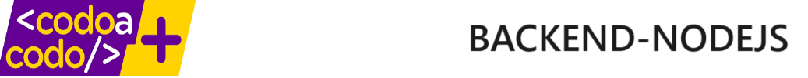

#### Author
Sabrina Lucero  
Nicolas Mazzitello  
Juan Camilo Monina  
Fabian Sarmiento  
2024

# Project backend Movies

## Descripción
Este proyecto es consiste en un desarrollo backend para una empresa de alquiler de películas.

## Características
- Alquiler de películas

## Tecnologías utilizadas
- NodeJS, Express, SQL
- Otras herramientas utilizadas: Git, Github, VSCode

## Instalación 

## Contribución

### Licencia 

MIT License

