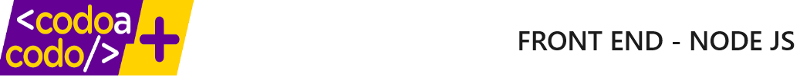

#### Authors
Sabrina Lucero 
Fabian Sarmiento
2024

# Project backend Movies

## Descripción
Este proyecto es consiste en un desarrollo backend para una empresa de alquiler de películas.

## Características
CRUD para la aplicación de gestión de películas y usuarios.

## Tecnologías utilizadas
- NodeJS, Express, SQL
- Otras herramientas utilizadas: Git, Github, VSCode

## Instalación 

Clonar este repositorio de la siguiente manera:
```
git clone <link del repositorio>
```
Una vez clonado el repositorio instalar las dependencias de la siguiente manera:
```
npm install
```

Posterior a la instalación de dependencias, dirigirse a la raíz del proyecto e iniciar el proyecto de la siguiente manera:
```
nodemon index.js
```

## Verficación de los endopoints

Para la verificación de los *endpoints* se adjunta la carpeta **Postman collections** donde se podrán encontrar el siguiente archivo:

1. test_backend.postman_collection.json 

El archivo mencionado previamente deberá utilizarse junto con la aplicación de APIs [**Postman**](https://www.postman.com/).

## Contribución


### Licencia 

MIT License



